<div align="center">

# Energy-Efficient Fast Object Detection on Edge Devices for IoT Systems

### Frame Difference + Lightweight AI Classifier for Fast-Moving Object Detection (FMOD)

<p>
<a href="https://arxiv.org/abs/2602.09515"></a>
<a href="https://doi.org/10.1109/JIOT.2025.3536526"></a>
<a href="https://doi.org/10.1109/JIOT.2025.3536526"></a>
<a href="#results"></a>
<a href="LICENSE"></a>
</p>

Mas Nurul Achmadiah · Afaroj Ahamad · Chi-Chia Sun · Wen-Kai Kuo

<sub>National Formosa University · National Taipei University · Yuan Ze University</sub>

<p>
📄 <a href="https://arxiv.org/abs/2602.09515"><b>Paper (arXiv)</b></a> &nbsp;·&nbsp;
🔗 <a href="https://doi.org/10.1109/JIOT.2025.3536526"><b>IEEE Xplore</b></a>
</p>

Official implementation. If you find this useful, please give it a star ⭐.

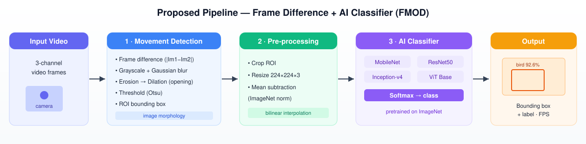

<table>
<tr>
<td>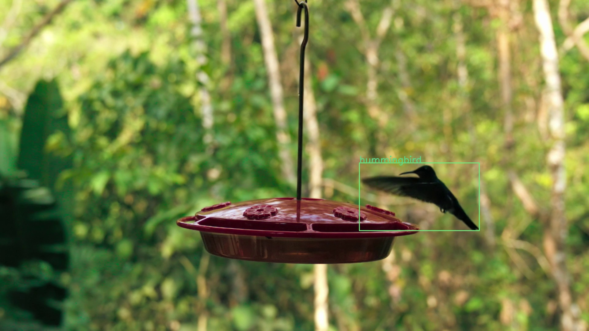</td>
<td>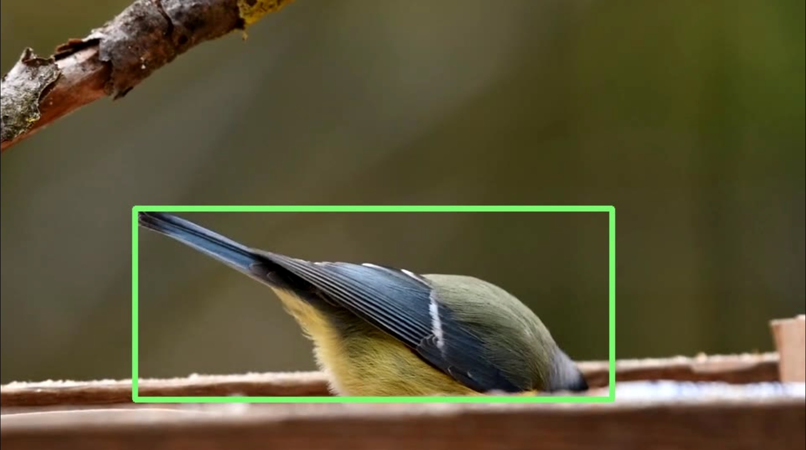</td>
</tr>
</table>
<sub>Real detections from the proposed frame-difference + classifier pipeline (hummingbird & blue tit).</sub>

</div>

---

## Overview

Real-time detection of **fast-moving objects (FMOD)** on power-constrained edge devices is hard:
end-to-end detectors (e.g., YOLO) process the whole frame every time, which is computationally
heavy and energy-hungry. This work proposes a **lightweight hybrid**: a classical
**frame-difference** motion detector that isolates only the moving region, followed by a
**lightweight AI classifier** that labels just that region.

Compared with the end-to-end baseline (YOLOX), the proposed method delivers large gains in accuracy,
energy efficiency, and latency — making it well suited for IoT systems where battery life and
real-time response matter.

<div align="center">
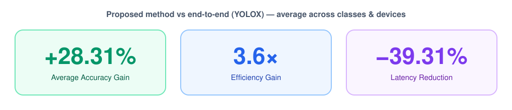
</div>

## Method

The algorithm runs as a per-frame loop with three stages: **(1) movement detection** via image
morphology, **(2) pre-processing** of the detected region, and **(3) classification** by a
lightweight CNN/Transformer. Because only the moving region of interest (ROI) is classified —
not the whole frame — the pipeline avoids the heavy global computation of end-to-end detectors.

| Stage | What happens |
|---|---|
| **1 · Movement Detection** | Absolute frame difference → grayscale → Gaussian blur → erosion + dilation (morphological opening) → Otsu threshold → ROI bounding box. |
| **2 · Pre-processing** | Crop the ROI → resize to `224×224×3` (bilinear) → ImageNet mean/std normalization. |
| **3 · AI Classifier** | MobileNet · ResNet50 · Inception-v4 · ViT Base → softmax → predicted class. |

<div align="center">
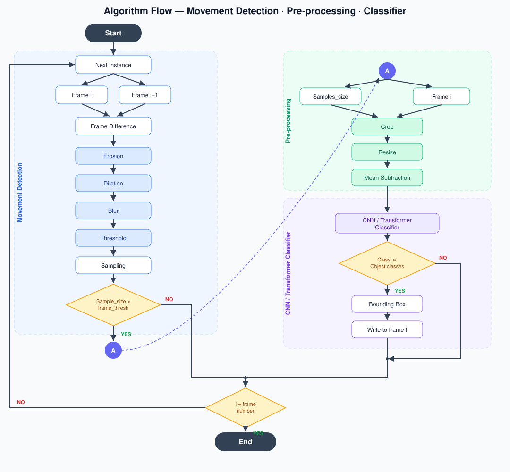
</div>

### Movement Detection, step by step

Two consecutive grayscale frames are subtracted; the result is cleaned with morphology and binarized
to isolate the moving region before the ROI is cropped.

<div align="center">
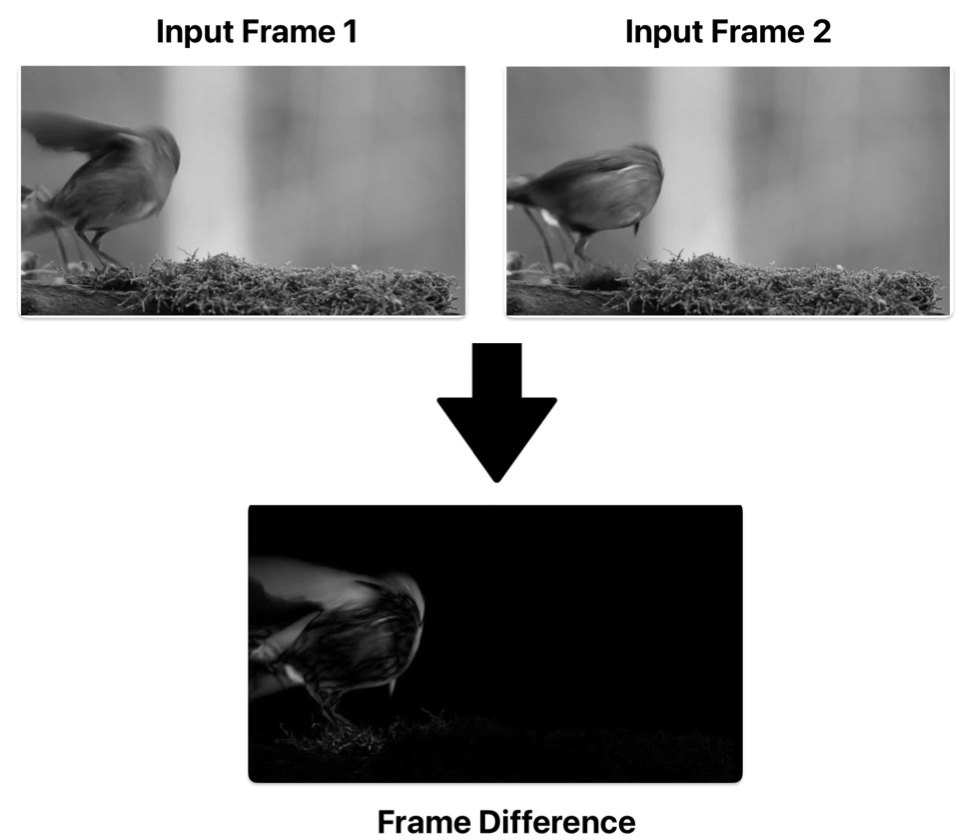<br>
<sub><b>Frame difference</b> — |Frame₁ − Frame₂| highlights the moving object.</sub>
</div>

| Step | Before → After |
|---|---|
| Erosion | 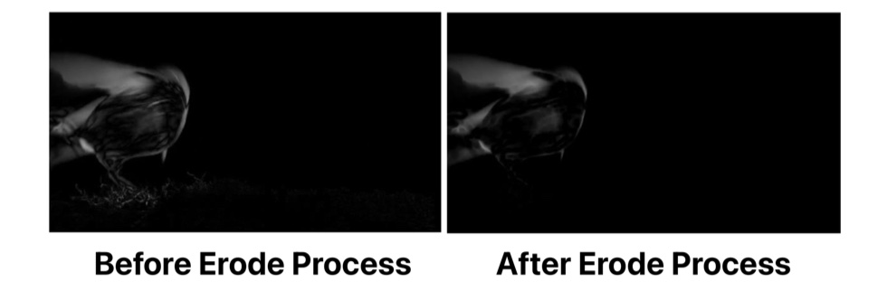 |
| Dilation | 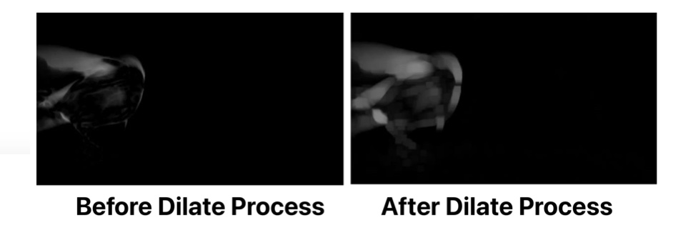 |
| Blurring | 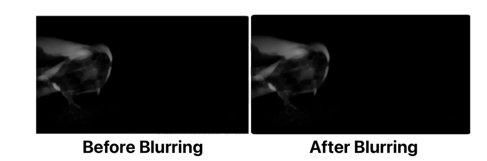 |
| Threshold (Otsu) | 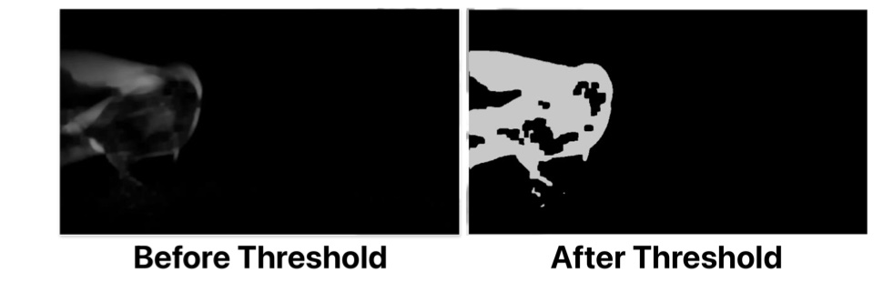 |

<details>
<summary><b>Original paper flowchart (Fig. 1)</b></summary>

<div align="center">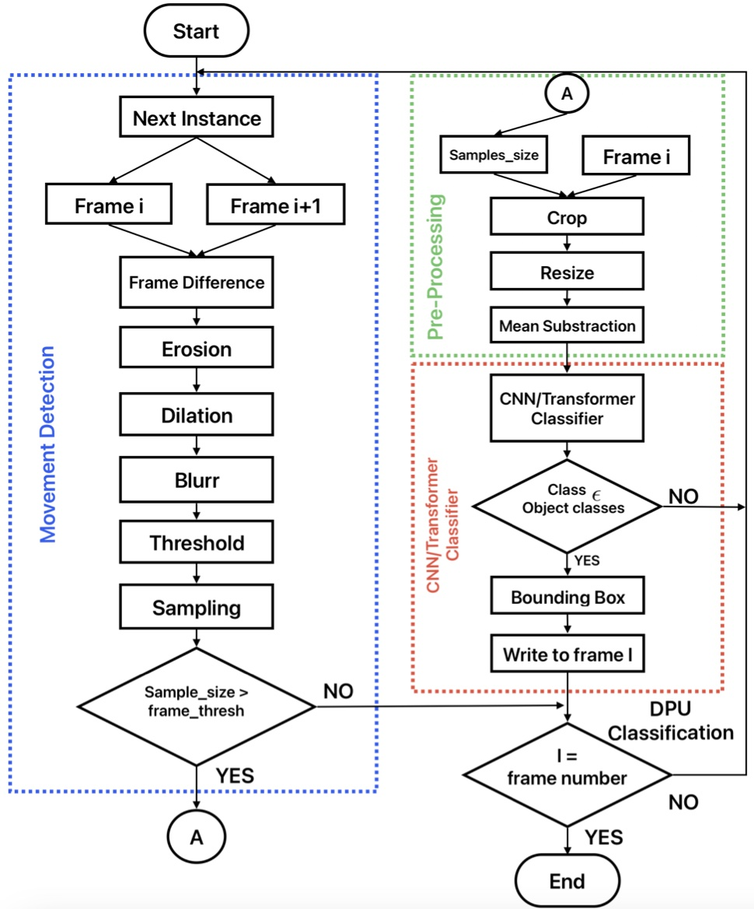</div>

</details>

## Hardware Deployment

The system is split between a **host PC** (CPU pre-processing + memory buffering) and an **edge
accelerator** that runs the motion-detection unit and the AI classifier. Three platforms are
evaluated, spanning FPGA, GPU, and a dedicated AI accelerator.

<div align="center">
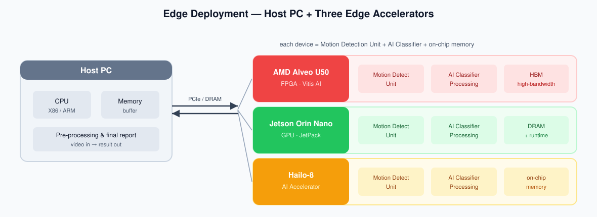
</div>

| Platform | Type | Toolchain | Power tool |
|---|---|---|---|
| AMD Alveo U50 | FPGA | Vitis AI | PowerTOP |
| NVIDIA Jetson Orin Nano | GPU (SoC) | JetPack | jtop |
| Hailo-8 | AI Accelerator | Hailo SDK | PowerTOP |

> Note: ViT Base is not evaluated on Alveo U50 (not supported by Vitis AI at the time of the study).

## Results

Across all classes and devices, the proposed frame-difference + classifier method improves the
**average accuracy by 28.31%**, the **average efficiency by 3.6×**, and reduces **average latency
by 39.31%** relative to the end-to-end YOLOX baseline.

<div align="center">
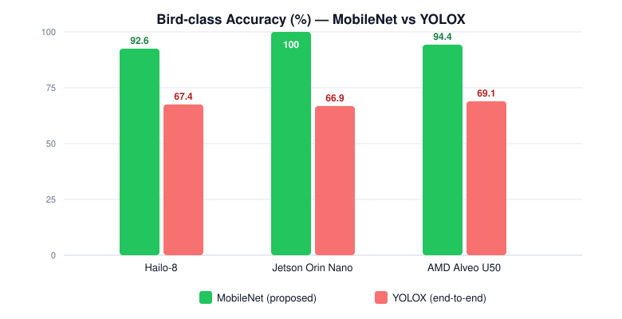
</div>

**Representative numbers (Bird class) — MobileNet (proposed) vs YOLOX (end-to-end):**

| Device | Model | Accuracy | Latency | Efficiency |
|---|---|:---:|:---:|:---:|
| Hailo-8 | MobileNet | **92.6%** | 35.63 ms | 0.1731 |
| Hailo-8 | YOLOX | 67.4% | 48.62 ms | 0.0393 |
| Jetson Orin Nano | MobileNet | **100%** | 41.38 ms | 0.8332 %/msW |
| Jetson Orin Nano | YOLOX | 66.92% | 61.67 ms | 0.4203 %/msW |
| AMD Alveo U50 | MobileNet | **94.39%** | 7.74 ms | 0.8935 %/mW |
| AMD Alveo U50 | YOLOX | 69.11% | 16.37 ms | 0.1189 %/mW |

Key takeaways from the paper: **MobileNet** is the most balanced choice across all three devices
(high accuracy, low latency, high energy efficiency); **YOLOX** consistently shows the lowest
accuracy and efficiency for fast objects. The hardest classes are **trains** and **airplanes**
(fastest motion → most blur).

<details>
<summary><b>Evaluation setup</b></summary>

- Classes: birds, cars, trains, airplanes.
- Classifiers: MobileNet, ResNet50, Inception-v4, ViT Base (ImageNet-pretrained); baseline YOLOX (MS-COCO).
- Metrics: Accuracy (%), Latency (ms), Energy (Joule), Efficiency (%/mW).
- Power/latency measured with PowerTOP (Alveo/Hailo) and jtop (Jetson).

</details>

## Qualitative Results

The detector localizes fast-moving birds in real footage and labels the cropped region with the
AI classifier. Bounding boxes are drawn only on the moving ROI returned by the frame-difference
stage.

<div align="center">
<table>
<tr>
<td align="center"><br><sub>Hummingbird in flight</sub></td>
<td align="center">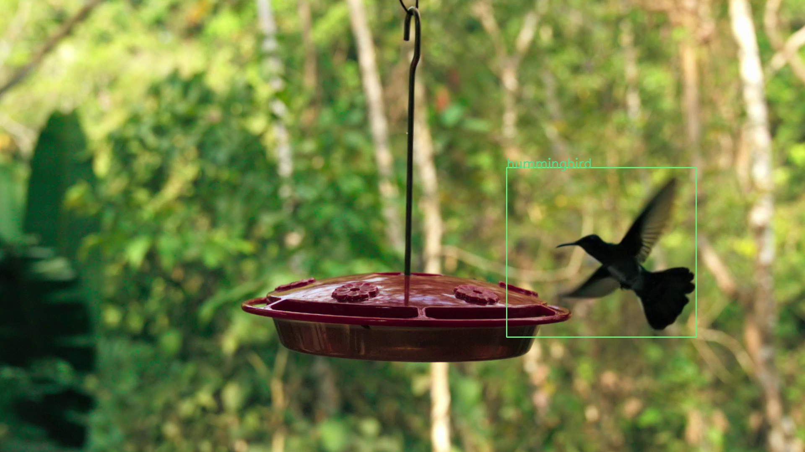<br><sub>Hummingbird approaching feeder</sub></td>
</tr>
<tr>
<td align="center"><br><sub>Blue tit on feeder</sub></td>
<td align="center">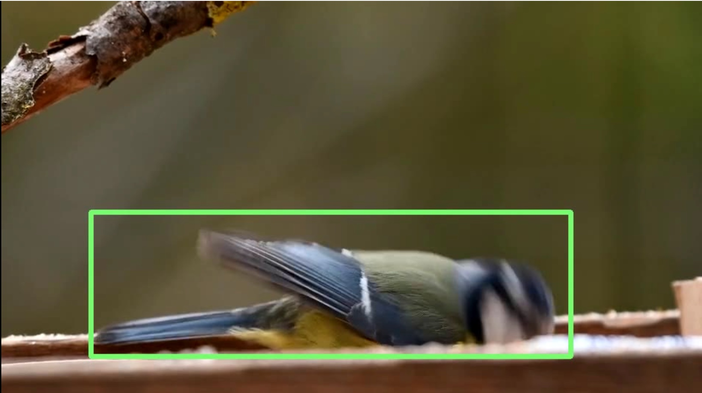<br><sub>Blue tit (motion blur)</sub></td>
</tr>
</table>
</div>

<details>
<summary><b>Algorithms (pseudo-code from the paper)</b></summary>

**Algorithm 1 — Feed Image** (frame buffering loop)

<div align="center">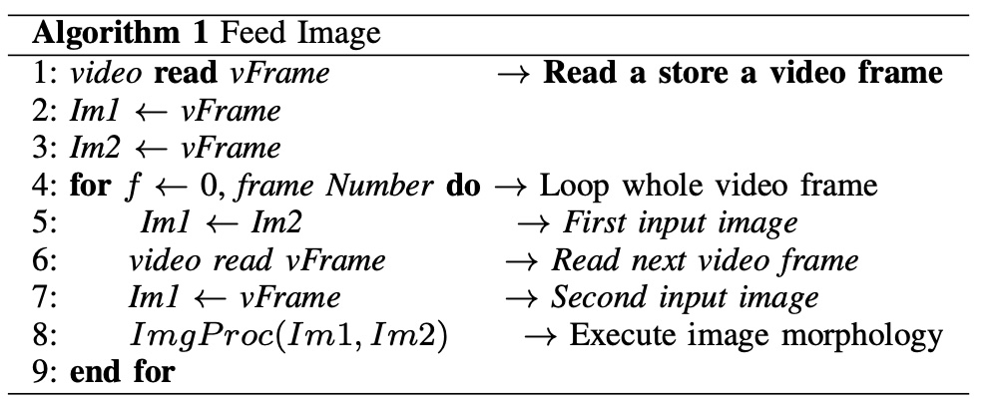</div>

**Algorithm 2 — Find ROI Arguments** (bounding-box extraction)

<div align="center">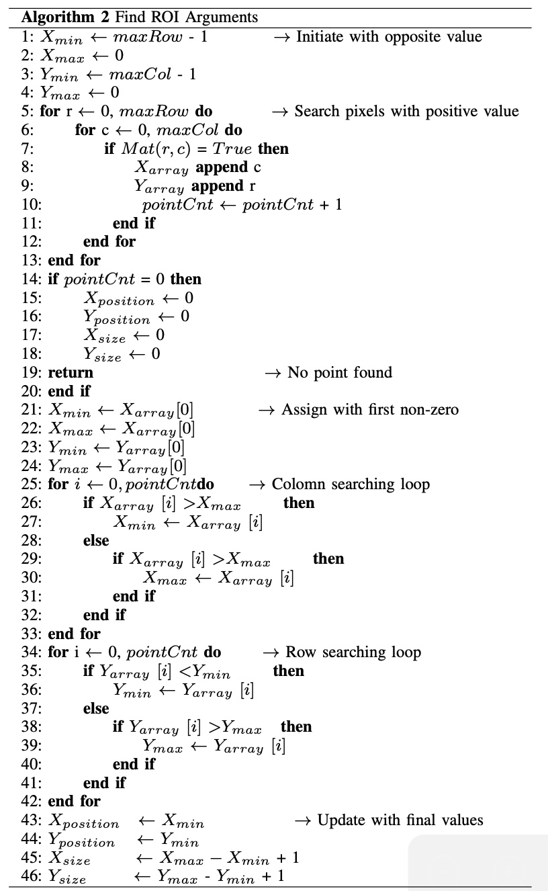</div>

</details>

## Repository Structure

```
fmod-edge-iot/
├── README.md
├── requirements.txt
├── LICENSE
├── assets/                          # figures
│   ├── pipeline.svg  flow_colored.svg  hardware.svg  gains.svg  accuracy_chart.svg  # colorful diagrams
│   ├── fig_flowchart.png                                          # full algorithm flowchart
│   ├── proc_frame_difference.png  proc_erode.png  proc_dilate.png # movement-detection steps
│   ├── proc_blur.png  proc_threshold.png
│   ├── algorithm1.png  algorithm2.png                            # pseudo-code
│   └── detect_*.{png,jpg}                                        # qualitative detections
└── src/
    ├── inference_edit.py       # Hailo-8 real-time inference (frame diff + classifier)
    └── class_name.py           # ImageNet label mapping (fill in for your model)
```

## Quick Start (Hailo-8)

The reference inference script targets the **Hailo-8** accelerator and reads a video, runs frame
differencing to find the ROI, classifies it, and overlays the label while reporting FPS/accuracy.

```bash
pip install -r requirements.txt
# hailo_platform comes from the Hailo SDK / HailoRT (install separately, not via PyPI)

# place a compiled model at  ./hef_model/resnet50.hef  and a video  ./<class>.mp4
python src/inference_edit.py
```

Edit the configuration block at the top of `src/inference_edit.py`:

```python
classifier_model = './hef_model/' + 'resnet50.hef'   # compiled .hef model
out_parser        = 'resnet50/fc1'                    # output node name
datatest          = 'hummingbird'                     # target class label / video name
dim               = (224, 224)                        # classifier input size
```

> Fill `src/class_name.py` with the 1000 ImageNet labels in the order your model outputs them,
> so `class_name[argmax(softmax(logits))]` resolves to the correct class.

## Citation

```bibtex
@article{achmadiah2025fmod,
  title   = {Energy-Efficient Fast Object Detection on Edge Devices for IoT Systems},
  author  = {Achmadiah, Mas Nurul and Ahamad, Afaroj and Sun, Chi-Chia and Kuo, Wen-Kai},
  journal = {IEEE Internet of Things Journal},
  volume  = {12},
  number  = {11},
  pages   = {16681--16694},
  year    = {2025},
  doi     = {10.1109/JIOT.2025.3536526},
  eprint  = {2602.09515},
  archivePrefix = {arXiv}
}
```

## Acknowledgements

This work was supported by the National Science and Technology Council, Taiwan
(Grant No. 113-2221-E-150-026-MY3). Built on the Hailo SDK, AMD Vitis AI, and NVIDIA JetPack,
with ImageNet-pretrained MobileNet, ResNet50, Inception-v4, and ViT Base.
